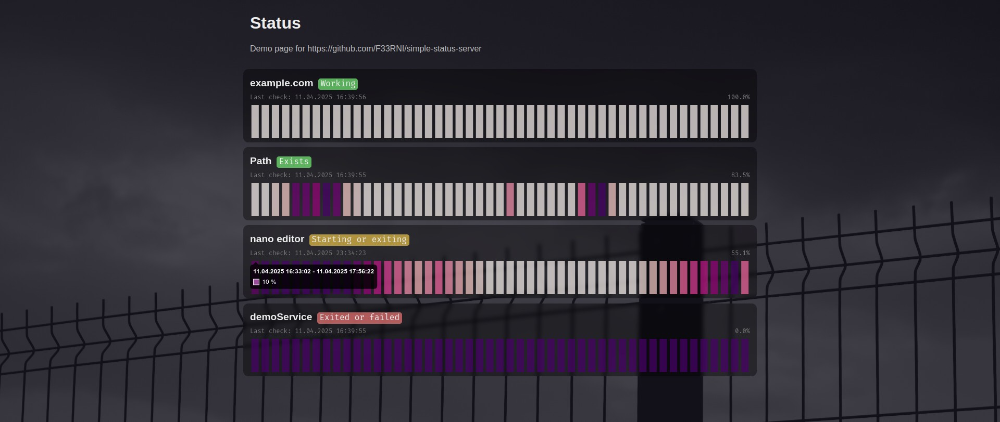

# 📊 simple-status-server

## Simple service / command / file / url status web server with logger, graphs and API



Highly configurable and stylish!

----------

## ❓ Getting started

### 1. Download / build simple-status-server

#### Download from GitHub releases

Got to <https://github.com/F33RNI/simple-status-server/releases/latest> and download the latest version

#### Run / build from source

```bash
# Clone repo
git clone https://github.com/F33RNI/simple-status-server.git
cd simple-status-server

# Initialize python environment and install dependencies
python -m venv venv
source venv/bin/activate
pip install -r requirements.txt

# Run as module
python -m simple_status_server --help

# OR build (NOTE: generated executable will be inside dist/ directory)
pip install pyinstaller
pyinstaller simple-status-server.spec
```

----------

### 2. Create / edit config file

You can copy `config.yaml.example` to `config.yaml` and edit as you need

> ⚠️ Please read comments inside `config.yaml.example`
>
> You can specify path to config file using `-c` / `--config` argument or `CONFIG_PATH` environment variable

#### Absolute minimal example

```yaml
# config.yaml

statuses:
  status1:
    type: url
    target: "https://example.com/"
    label: "example.com"
```

#### More advanced example

<details>
<summary>Click to expand</summary>

```yaml
# config.yaml

logging:
  level: info

server:
  host: 127.0.0.1
  port: 8080
  api_key: 12345678

page:
  description: "Current status of services"

database_path: "database.json"

statuses:
  demoURL1:
    type: url
    target: "https://example.com/"
    interval: 1m
    checks_per_bar: 10
    label: "example.com"
  demoURL2:
    type: url
    target: "https://pypi.org/"
    label: "PyPi"
  demoService:
    type: service
    target: "something.service"
    interval: 1m
    checks_per_bar: 5
    value_working: "Running"
    value_not_working: "Exited or failed"
    no_intermediate_value: true
```

</details>

#### Custom fancy background

> Please read `simple_status_server/static/styles/stylesheet.css` file for reference

<details>
<summary>Click to expand</summary>

```yaml
#...

page:
  extra_css: 'body { background-color: black; background: linear-gradient(0deg, oklch(21.56% 6.267126% 291 / 70%), oklch(21.56% 6.267126% 291 / 70%)), url(https://upload.wikimedia.org/wikipedia/commons/thumb/0/05/2006-02-15_Piping.jpg/1280px-2006-02-15_Piping.jpg) no-repeat fixed; background-size: cover; min-height: 100%; height: 100%; } .status { background-color: rgba(0, 0, 0, 0.4); backdrop-filter: blur(4px); }'

#...
```

</details>

----------

### 3. Start simple-status-server

#### CLI usage

```text
usage: simple-status-server [-h] [-c path/to/config.yaml] [--host HOST] [--port PORT] [--api-key API_KEY]
                            [--database path/to/database.json] [-v]

Simple service / command / file / url status web server with logger, graphs and API

options:
  -h, --help            show this help message and exit
  -c, --config path/to/config.yaml
                        path to config file (CONFIG_PATH env variable, default: config.yaml)
  --host HOST           server's host (HOST env variable, default: 127.0.0.1)
  --port PORT           server's port (PORT env variable, default: 8080)
  --api-key API_KEY     API key to restrict access to web page and API (API_KEY env variable, default: None)
  --database path/to/database.json
                        path to database file that stores collected statuses (DATABASE_PATH env variable, default:
                        database.json)
  -v, --version         show program's version number and exit
```

#### API Key info

- This option exists to restrict access to the web page and API. Please note that enabling this option and **not
using SSL is not secure**. Consider reading the `🌐 proxy_pass + SSL via nginx` section

- **To access web page** with api key enabled, add it as `apiKey` URL parameter. Example:
`https://status.youdomain.com/?apiKey=12345678`

- **To get data from API**, you must provide `apiKey` in JSON body. Curl example:

    ```bash
    curl -X POST -H "Content-Type: application/json" -d '{"apiKey":"12345678"}' https://status.youdomain.com/
    ```

----------

## 🌐 `proxy_pass` + SSL via nginx

Below is example config file to secure status server with SSL

```nginx
# /etc/nginx/sites-available/status.conf

upstream ssimple-status-serverimple-status-server {
    server 127.0.0.1:8080;
}

server {
    listen 443 ssl;
    listen [::]:443 ssl;

    server_name status.domain.com;

    ssl_certificate "/etc/ssl/domain.com/chained.pem";
    ssl_certificate_key "/etc/ssl/domain.com/private.key";

    location / {
        client_max_body_size 16k;

        proxy_pass http://simple-status-server;

        proxy_set_header Host $http_host;
        proxy_set_header X-Real-IP $remote_addr;
        proxy_set_header X-Forwarded-For $proxy_add_x_forwarded_for;
        proxy_set_header X-Forwarded-Proto $scheme;

        proxy_redirect off;
        proxy_buffer_size 16k;
        proxy_read_timeout 60s;
        proxy_buffers 32 16k;
        proxy_busy_buffers_size 64k;
        proxy_cache off;

        add_header 'Cache-Control' 'no-store, no-cache, must-revalidate, proxy-revalidate, max-age=0';
        expires off;
    }
}
```

----------

## 🐧 Linux service

Below is example of unit file for systemd

> Replace `/path/to/simple-status-server` to the actual path of directory and `yourusername` with your actual user

```ini
# /lib/systemd/system/simple-status-server.service

[Unit]
Description=simple-status-server server
After=network.target

[Service]
Type=simple
WorkingDirectory=/path/to/simple-status-server
ExecStart=/path/to/simple-status-server/simple-status-server
User=yourusername
Group=yourusername

[Install]
WantedBy=multi-user.target

```

----------

## ✨ Contribution

- Anyone can contribute! Just create a **pull request**
- Please use black formatter style for code
- Please use [Conventional Commits](https://www.conventionalcommits.org/en/v1.0.0/#specification>) style for commits
